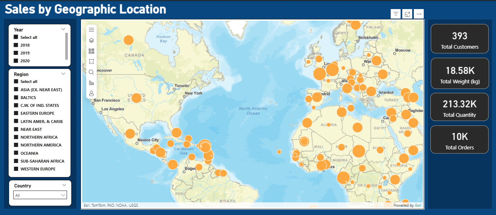
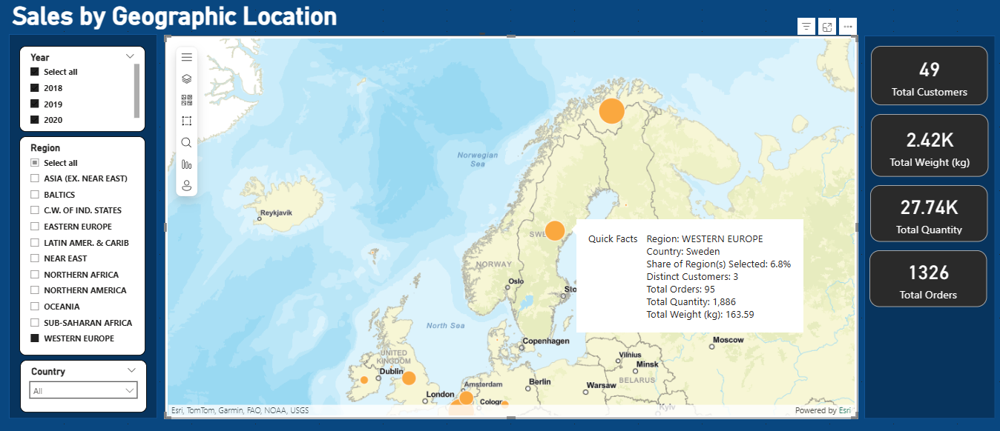
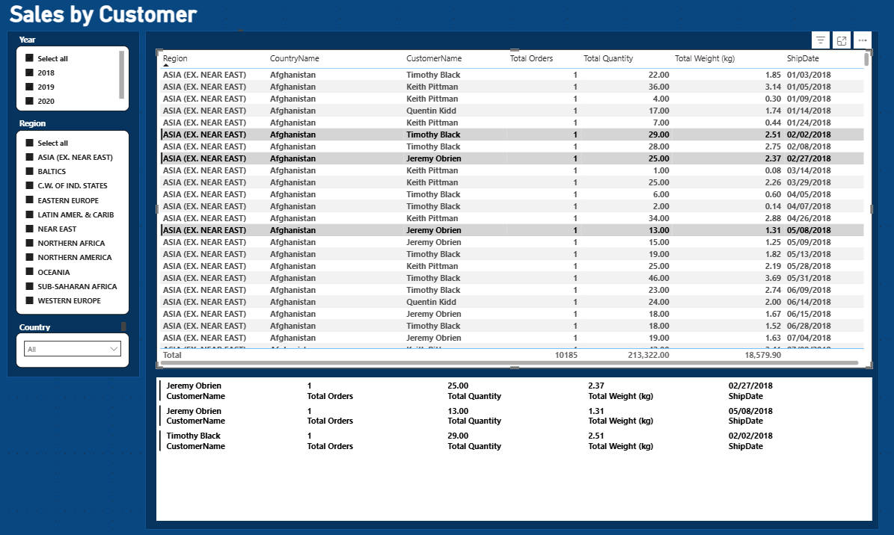
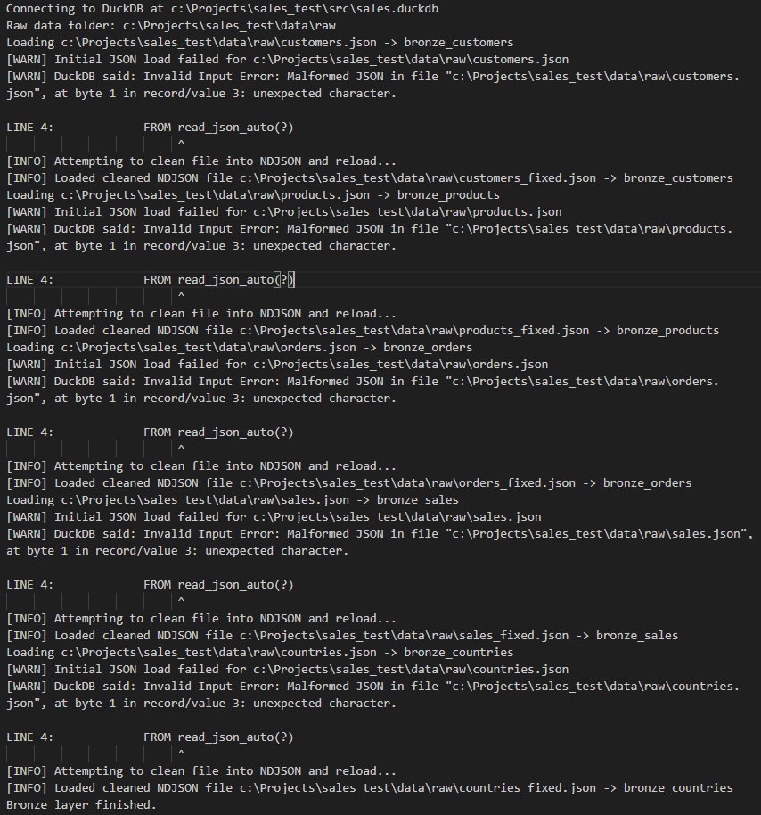
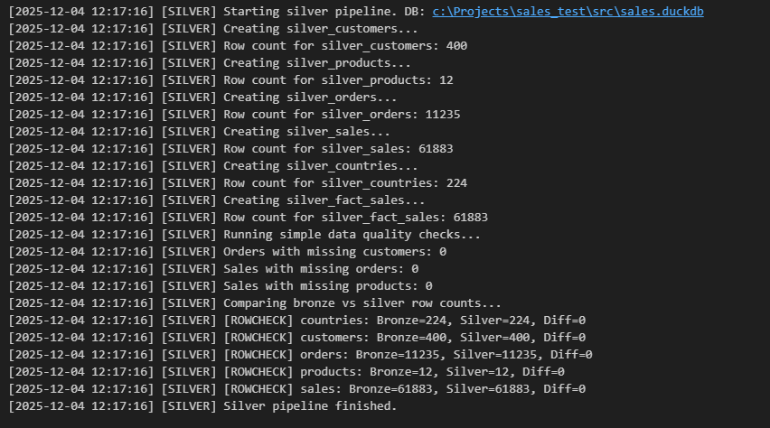
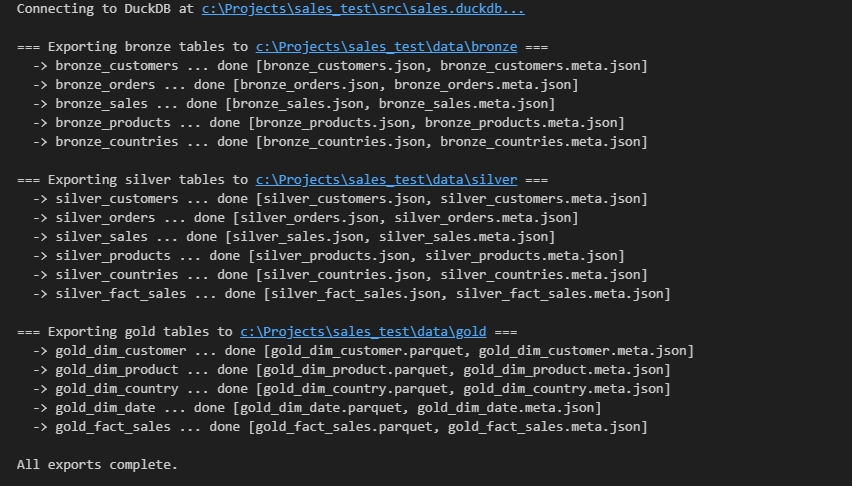

## Stakeholder Problem Statement
- Stakeholder wants to see sales by customer.
- Stakeholder wants to see sales by geo-location.

---

## Medallion Pipeline Overview

This project implements a simple medallion pipeline in DuckDB with four execution steps. Each step is location aware and does not depend on the current working directory.

All scripts live under `src/pipelines`.

The four steps are:

## 1. Bronze Load  
**File:** `step01_bronze_load.py`  
**Notebook:** `step01_bronze_load.ipynb`

Purpose:

- Read raw JSON files under `data/raw`
- Handle loose or malformed JSON by converting to NDJSON if needed
- Create bronze tables in DuckDB with minimal interpretation
- Preserve source structure so later layers can clean and type cast

Output tables:

- bronze_customers
- bronze_products
- bronze_orders
- bronze_sales
- bronze_countries

## 2. Silver Load  
**File:** `step02_silver_load.py`  
**Notebook:** `step02_silver_load.ipynb`

Purpose:

- Enforce column types and remove junk rows  
- Standardize common fields  
- Build cleaned dimension tables and a row level fact table  
- Log counts and basic data quality checks  
- Provide a stable semantic structure for downstream modeling

Output tables:

- silver_customers
- silver_products
- silver_orders
- silver_sales
- silver_countries
- silver_fact_sales

## 3. Gold Load  
**File:** `step03_gold_load.py`  
**Notebook:** `step03_gold_load.ipynb`

Purpose:

- Build semantic model style tables for presentation and analytics  
- De pluralize dimension tables for easier consumption in BI tools  
- Generate a calendar dimension from order history  
- Create a fact table with pre calculated measures and clean surrogate keys

Output tables:

- gold_dim_customer  
- gold_dim_product  
- gold_dim_country  
- gold_dim_date  
- gold_fact_sales

## 4. Export Medallion Layers  
**File:** `step04_export_medallion_layers.py`  
**Notebook:** `step04_export_medallion_layers.ipynb`

Purpose:

- Export each medallion layer to disk in a simple, portable format  
- Bronze and Silver export as JSON  
- Gold exports as Parquet  
- Write metadata sidecar files describing column types and row counts  
- Output folders are created automatically  
- All paths are resolved relative to the project root

Export location for parquet files:  

- /data/gold


## Power BI Screenshots

### Stakeholder wants to see sales by geo-location.

<div style="border: 2px solid #666; padding: 6px; display: inline-block;">
    
</div>
<br><br>


### Region select with tool tip data.

<div style="border: 2px solid #666; padding: 6px; display: inline-block;">
    
</div>
<br><br> 

### Stakeholder wants to see sales by customer.

<div style="border: 2px solid #666; padding: 6px; display: inline-block;">
    
</div>
<br><br> 


## Bronze Load 

<div style="border: 2px solid #666; padding: 6px; display: inline-block;">
    
</div>
<br>


## Silver Load 

<div style="border: 2px solid #666; padding: 6px; display: inline-block;">
    
</div>
<br>


## Gold Load 

<div style="border: 2px solid #666; padding: 6px; display: inline-block;">
    
</div>
<br>


## Parquet Export 

<div style="border: 2px solid #666; padding: 6px; display: inline-block;">
    
</div>
<br>


## Using the Gold Layer

The Gold layer is organized so that tools like Power BI can read it easily and produce consistent results without extra modeling work. Power BI reads the Gold layer from Parquet files, which keeps the data lightweight and easy to work with.

Below are some  points that help users understand how the data behaves and how to get the best results from it.

---

### What the Fact Table Represents

The table `gold_fact_sales` contains one row per sales transaction. Each row already includes the key information needed for reporting:

- When the sale happened  
- Who the customer was  
- What product was sold  
- Which country the customer belongs to  
- How much was sold and how much it weighed  

This makes it easy to build totals, comparisons, and trends without extra prep work.

---

### What the Dimension Tables Provide

Dimension tables supply the descriptive fields used for grouping and filtering in reports.

- `gold_dim_date`: clean calendar with year, quarter, month, week, weekday info  
- `gold_dim_customer`: customer details such as name, city, and country  
- `gold_dim_product`: product names and manufacturing country  
- `gold_dim_country`: additional context about each country  

These tables connect directly to the fact table so reports use consistent definitions across dashboards.

---

### How the Tables Connect

Use the following links when building a model in Power BI:

```
gold_fact_sales.DateKey      -> gold_dim_date.DateKey
gold_fact_sales.CustomerId   -> gold_dim_customer.CustomerId
gold_fact_sales.ProductId    -> gold_dim_product.ProductId
gold_fact_sales.Country      -> gold_dim_country.Country
```

These connections ensure that totals, drilldowns, and time-based comparisons behave as expected.

---

### Countries With No Sales

The country list includes locations with no recorded sales. Since these countries do not appear in the fact table, Power BI (via ArcGIS) pushes them to the Prime Meridian and Equator fallback point (0, 0), causing them to appear in the Atlantic on the map. The solution is to use a static Power BI filter to exclude these countries from the data. 

This keeps reports uncluttered and functional, but it also creates room for future analysis. If someone wanted to look at markets where the company has no sales yet, the country table has maintained the no-sale countries.

---

If future metrics or subject areas are added, they can be integrated into this structure without reworking the existing model. The goal is to maintain a consistent and easy-to-understand reporting layer that grows with the operational needs.


